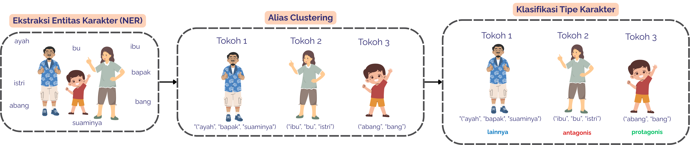
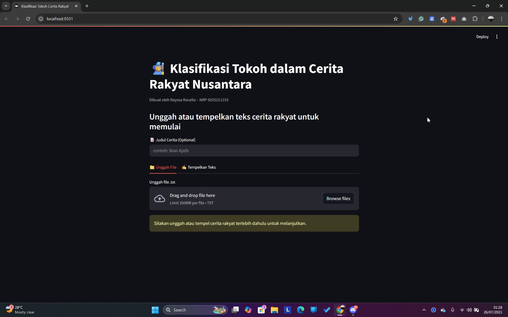

# 🏁 Tugas Akhir (TA) - Final Project

**Nama Mahasiswa**: Rayssa Ravelia  
**NRP**: 5025211219  
**Judul TA**: Klasifikasi Tipe Tokoh Protagonis dan Antagonis dalam Cerita Rakyat Nusantara Menggunakan *Named Entity Recognition (NER)*  
**Dosen Pembimbing**: Dini Adni Navastara, S.Kom., M.Sc. (NIP 198510172015042001)  
**Dosen Ko-pembimbing**: Prof. Dr. Ir. Diana Purwitasari, S.Kom., M.Sc. (NIP 197804102003122001)

---

## 📝 Deskripsi Singkat Proyek

Cerita rakyat Nusantara menyimpan kekayaan naratif yang penting bagi pelestarian budaya, namun analisis manual terhadap struktur dan karakter di dalamnya sangat memakan waktu.  
Penelitian ini mengusulkan pendekatan otomatis berupa **pipeline bertingkat** yang terdiri dari tiga tahapan utama:

1. **Named Entity Recognition (NER)** <br>
untuk mengekstraksi entitas karakter dari paragraf narasi,
2. **Alias Clustering** <br>
untuk menyatukan penyebutan karakter yang berbeda namun merujuk ke entitas yang sama menggunakan *similarity distance* dan *word sense mapping*,
3. **Klasifikasi Tipe Karakter** <br>
(protagonis, antagonis, atau lainnya) menggunakan pendekatan leksikal, *machine learning* klasik, dan *deep learning* berbasis BERT.

Gambar di bawah ini menunjukkan tiga tahapan utama dalam sistem yang dibangun:


Hasil pengujian menunjukkan bahwa:
- **NER terbaik** diperoleh dengan model *CahyaBERT 1.5G* (F1-score 0,8940),
- **Clustering terbaik** menggunakan kombinasi *Jaro-Winkler* dan *word sense mapping* (F1-score 0,6038),
- **Klasifikasi terbaik** dicapai oleh *Random Forest Normalized* dengan mekanisme majority vote (F1-score 0,9069).

Meskipun hasilnya menjanjikan, tantangan tetap ditemukan terutama pada konsistensi alias clustering.  
Penelitian ini berkontribusi dalam digitalisasi cerita rakyat serta pengembangan teknologi *Natural Language Processing (NLP)* untuk bahasa Indonesia.

---

## 📺 Demo Aplikasi  

[](https://www.youtube.com/watch?v=wO6AzzGSVq0)  
*Klik gambar di atas untuk menonton demo*  
💡 *Catatan: Lewati ke menit **05:05** jika ingin langsung melihat bagian demonstrasi aplikasi.*

## 🗂️ Struktur Direktori
```
ta-rayrednet/
├── app/ # Aplikasi Streamlit dan seluruh kode program terbaik
├── data/ # Kumpulan data yang digunakan (raw, preprocessed, dsb)
├── img/ # Kumpulan gambar ilustratif untuk README
├── notebooks/ # Notebook seluruh uji coba (NER, clustering, klasifikasi)
├── requirements.txt # Daftar dependensi Python
├── LICENSE # Lisensi penggunaan proyek
└── README.md # Dokumentasi utama proyek
```

## 🛠 Panduan Instalasi & Menjalankan Software  

### Prasyarat  
- Python 3.10+
- pip
- Git

### 🚀 Cara Menjalankan Aplikasi

1. **Clone Repository**

   ```bash
   git clone https://github.com/Informatics-ITS/ta-rayrednet.git
   ```

2. **Aktifkan Virtual Environment (Opsional tapi Direkomendasikan)** <br>
   Jalankan perintah berikut sesuai dengan sistem operasi kamu:

   ```bash
   python -m venv .venv
   source .venv/bin/activate  # Untuk Mac/Linux
   .venv\Scripts\activate     # Untuk Windows
   ```

3. **Install Dependensi** <br>
   Install semua dependensi Python yang diperlukan:

   ```bash
   pip install -r requirements.txt
   ```

4. **Download Model** <br>
   Sebelum menjalankan aplikasi, pastikan kamu sudah mengunduh model-model terbaik yang diperlukan.
   Masuk ke folder berikut dan ikuti instruksi pada README-nya:

   ```bash
   cd app/models/
   ```

   📄 Petunjuk dan link download tersedia di file: `README.md`

5. **Jalankan Aplikasi Streamlit** <br>
   Setelah model berhasil diunduh dan diekstrak, masuk ke folder `app/` dan jalankan aplikasi:

   ```bash
   cd app
   streamlit run demo_app/app.py
   ```

6. **Buka di Browser** <br>
   Aplikasi akan berjalan secara lokal dan bisa diakses melalui:

   ```arduino
   http://localhost:8501
   ```

   Berikut tampilan antarmuka aplikasi:

   

   Untuk penjelasan lebih detail mengenai cara kerja aplikasi, silakan tonton video demo pada bagian di atas.
   
---

## 📎 Arsip Lengkap Tugas Akhir
Seluruh dokumen pendukung seperti **buku TA**, **poster**, **PPT presentasi**, **video demo**, dan **paper** tersedia pada tautan berikut:

📂 [Klik untuk membuka Google Drive](https://drive.google.com/drive/folders/1nJVvCZKzHXihnpvzIRRnbumvIfKEHKg2?usp=drive_link)

---

## ⁉️ Pertanyaan?

Hubungi:
- Penulis: [5025211219@student.its.ac.id](mailto:5025211219@student.its.ac.id)
- Pembimbing Utama: [dini_navastara@if.its.ac.id](mailto:dini_navastara@if.its.ac.id)
- Ko-pembimbing: [diana@if.its.ac.id](mailto:diana@if.its.ac.id)
