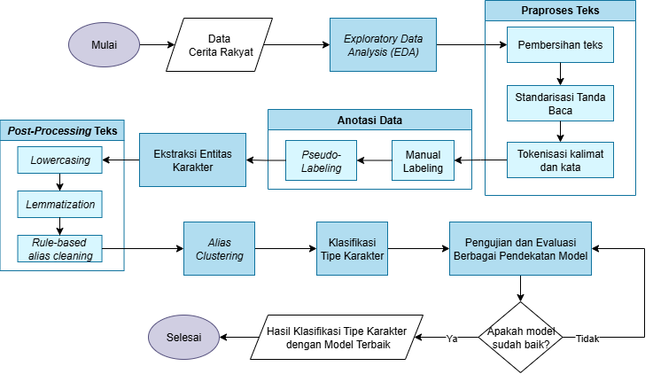

# 📂 Folder `notebooks/`

Struktur folder pada direktori ini mengikuti tahapan alur kerja sistem klasifikasi tipe karakter seperti yang ditampilkan pada diagram alir berikut:

  

Setiap sub-folder berisi notebook yang mendokumentasikan dan mengimplementasikan tahap-tahap dalam alur sistem:

| No | Folder                                | Deskripsi                                                                 |
|----|---------------------------------------|---------------------------------------------------------------------------|
| 1  | `1_eda_dan_preprocessing/`            | Notebook untuk eksplorasi awal dan praproses teks cerita rakyat          |
| 2  | `2_ekstraksi_entitas_karakter/`       | Implementasi ekstraksi entitas karakter menggunakan Named Entity Recognition (NER) |
| 3  | `3_post_processing/`                  | Proses pembersihan lanjutan seperti lowercasing, lemmatization, dan penyatuan alias |
| 4  | `4_alias_clustering/`                 | Notebook untuk clustering alias karakter berdasarkan kemiripan           |
| 5  | `5_feature_engineering/`              | Ekstraksi fitur numerik dari karakter dalam konteks kalimat              |
| 6  | `6_klasifikasi_tipe_karakter/`        | Notebook untuk pelatihan dan evaluasi model klasifikasi tipe karakter    |
| 7  | `7_majority_vote_sentence_level/`     | Penggabungan hasil klasifikasi berbasis majority voting per karakter     |

## 📓 Penjelasan Tiap Folder

### 📁 `1_eda_dan_preprocessing/`

Folder ini berisi dua file notebook utama:

- 📓 `eda.ipynb` – Menampilkan proses eksplorasi data awal terhadap cerita rakyat, seperti jumlah cerita, distribusi panjang cerita, dan insight awal lainnya.
- 📓 `preprocessing.ipynb` – Berisi tahapan pembersihan data seperti penghapusan karakter tidak penting, standarisasi tanda baca, dan tokenisasi kalimat serta kata.

Tahapan ini merupakan bagian awal dari pipeline sesuai diagram alir sistem.

### 📁 `2_ekstraksi_entitas_karakter/`

Folder ini berisi dua pendekatan utama dalam ekstraksi entitas karakter dari cerita rakyat:

- 📂 `ner/` – Pendekatan Named Entity Recognition (NER) menggunakan beberapa model:
  - 📓 `cahyabert.ipynb` – Menggunakan model `cahya/bert-base-indonesian`.
  - 📓 `flair.ipynb` – Menggunakan pustaka Flair untuk ekstraksi entitas.
  - 📓 `spacy.ipynb` – Pendekatan NER berbasis spaCy.
  - 📓 `stanza.ipynb` – NER menggunakan toolkit Stanza.

- 📂 `pos_tagging/` – Pendekatan berbasis Part-of-Speech (POS) tagging:
  - 📓 `pos-tagging.ipynb` – Menampilkan hasil ekstraksi entitas dengan aturan berbasis tag kata benda/proper noun.

Pendekatan NER digunakan untuk menghasilkan label karakter secara kontekstual, sementara POS tagging digunakan sebagai baseline pembanding.

### 📁 `3_post_processing/`

Folder ini berisi tahap *post-processing* yang dilakukan sebelum masuk ke proses *alias clustering*.  
- 📓 `post_preprocessing.ipynb` – Digunakan untuk merapikan hasil ekstraksi entitas karakter.

### 📁 `4_alias_clustering/`
Berisi notebook untuk menyatukan alias tokoh yang merujuk pada entitas yang sama.

- 📓 `string_similarity.ipynb` – Clustering alias berdasarkan kemiripan string.
- 📓 `word_sense.ipynb` – Clustering dengan mempertimbangkan makna kata dan konteks (word sense mapping) yang dilakukan setelah string similarity.

### 📁 `5_feature_engineering/`
Berisi proses rekayasa fitur terhadap karakter sebelum dilakukan klasifikasi tipe karakter.

- 📓 `feature_engineering.ipynb` – Notebook yang mengekstraksi  dan membuat fitur-fitur penting dari karakter berdasarkan kalimat naratif.

### 📁 `6_klasifikasi_tipe_karakter/`
Berisi eksperimen klasifikasi tipe karakter menggunakan berbagai pendekatan pada dua level: karakter dan kalimat.

- 📂 `character_level/` – Klasifikasi berdasarkan agregasi per karakter:
  - 📂 `dl/` – Deep learning:
    - 📓 `dl_character_level.ipynb`
  - 📂 `lexicon/` – Lexicon-based:
    - 📓 `lexicon_character_level.ipynb`
  - 📂 `ml/` – Classical machine learning:
    - 📓 `classical_ml_sentence_level.ipynb`

- 📂 `sentence_level/` – Klasifikasi dilakukan per kalimat tempat karakter muncul:
  - 📂 `dl/` – Deep learning:
    - 📓 `dl_sentence_level.ipynb`
  - 📂 `lexicon/` – Lexicon-based:
    - 📓 `lexicon_sentence_level.ipynb`
  - 📂 `ml/` – Classical machine learning:
    - 📓 `classical_ml_sentence_level.ipynb`

### 📁 `7_majority_vote_sentence_level/`
Berisi hasil integrasi prediksi menggunakan metode majority vote khusus pada level kalimat, untuk model terbaik dari masing-masing pendekatan.

- 📓 `dl_best_model.ipynb` – Majority vote berdasarkan model deep learning terbaik.
- 📓 `ml_best_model.ipynb` – Majority vote berdasarkan model machine learning klasik terbaik.
